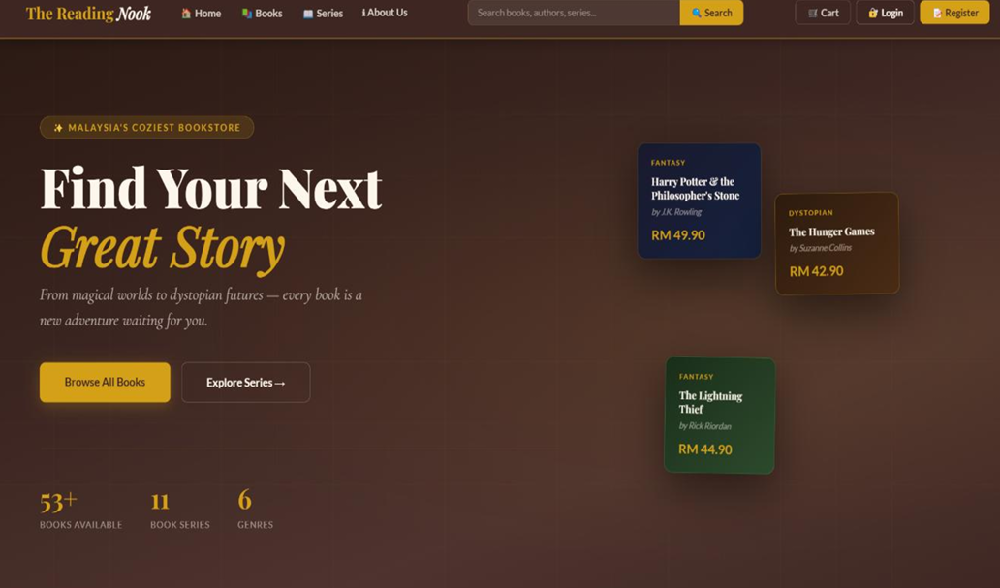
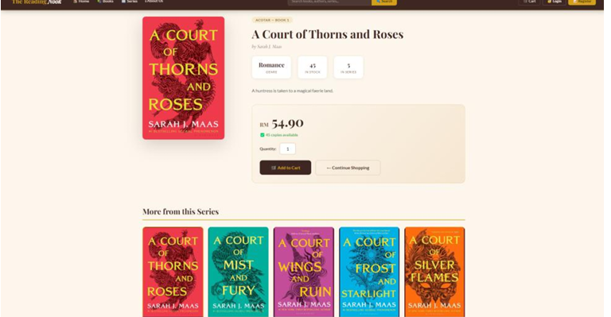
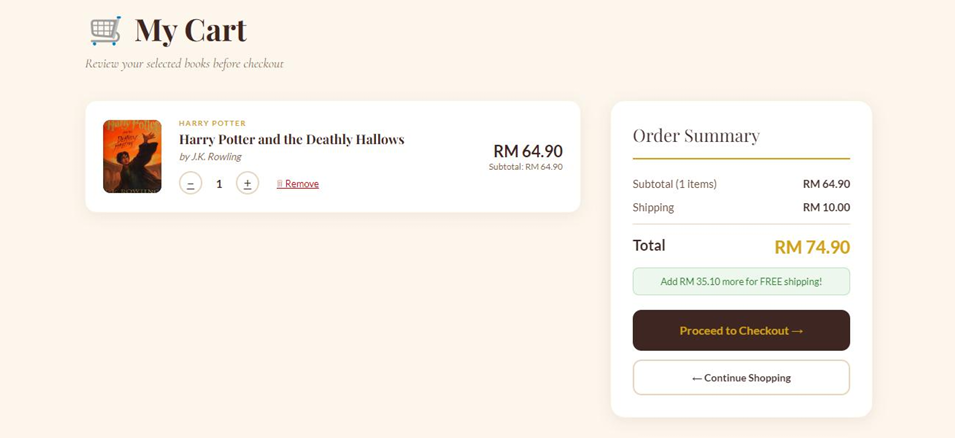
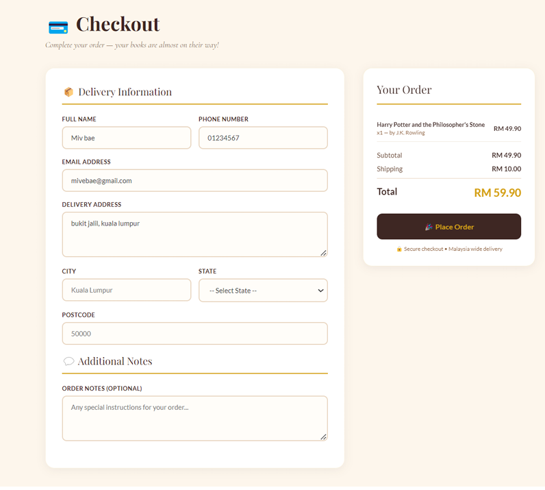
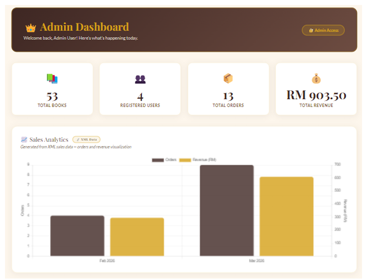

# 📚 PageTurner Bookstore

An online bookstore web application developed as an **XML and e-commerce project**, allowing customers to browse and purchase books while providing administrators with tools to manage inventory, orders, XML data, and reports.

The project demonstrates the practical use of **XML, DTD, and XSLT** within an ASP.NET Web Forms application, together with a Microsoft SQL Server database.

## ✨ Features

### Customer Features

* 👤 User registration and login
* 🔎 Search books by title, author, series, or genre
* 📚 Browse books by genre and series
* 📖 View detailed book information
* 🛒 Add, update, and remove items from the shopping cart
* 💳 Checkout and place orders
* 📦 View previous orders and order status
* 🎯 Interactive book recommendation quiz

### Administrator Features

* 🔐 Role-based admin access
* 📊 Admin dashboard with sales analytics
* 📚 Manage book inventory, stock, and prices
* 📦 View customer orders
* 📄 Export the book catalogue as XML
* 📈 Generate reports using XSLT
* 📊 View order, revenue, genre, and order-status analytics

## 🧩 XML & XSLT Implementation

A major focus of this project was integrating XML technologies into a functional e-commerce application.

### XML

XML is used for:

* Book catalogue data
* Order and transaction data
* Advertisement content
* Book quiz questions
* Data exchange and reporting

### DTD

DTD is used to validate the structure of XML documents and ensure that exported XML data follows the required format.

### XSLT

XSLT is used to transform XML data into formatted HTML reports, particularly for book catalogue and order reporting.

### SQL Server → XML

The administrator can export book catalogue data from SQL Server using the **FOR XML** functionality and process the resulting XML through validation and XSLT transformation.

## 🛠️ Technologies Used

* **C#**
* **ASP.NET Web Forms**
* **.NET Framework 4.8**
* **Microsoft SQL Server**
* **XML**
* **DTD**
* **XSLT**
* **HTML / CSS / JavaScript**
* **Visual Studio 2022**
* **IIS Express**

## 🗂️ Main Project Components

```text
PageTurner Bookstore
│
├── App_Start
├── Content
├── Images
├── Pages
├── Scripts
├── XML
│   ├── books.xml
│   ├── orders.xml
│   ├── ads.xml
│   ├── quiz.xml
│   ├── books.dtd
│   ├── orders.dtd
│   ├── quiz.dtd
│   ├── books.xslt
│   └── orders.xslt
│
├── databasecripts
├── App_Data
├── Web.config
├── Global.asax
│
├── BookList.aspx
├── BookDetail.aspx
├── Cart.aspx
├── Checkout.aspx
├── Login.aspx
├── Register.aspx
├── OrderHistory.aspx
├── AdminDashboard.aspx
└── BookQuiz.aspx
```

## 🔐 Security

The application includes:

* ASP.NET Forms Authentication
* Role-based authorization
* Customer and administrator access levels
* SHA-256 password hashing
* Session-based user authentication
* Parameterized SQL queries

## 🎯 Project Highlights

Some of the main areas demonstrated through this project include:

* Designing an e-commerce application
* Integrating XML with a web application
* XML document validation using DTD
* Transforming XML using XSLT
* SQL Server database integration
* User authentication and role-based access
* Shopping cart and order processing
* XML-based reporting
* Dynamic search and filtering
* Admin dashboards and sales analytics

## 📌 Project Context

**Project:** Developing E-Commerce Applications with XML
**Application:** PageTurner Bookstore
**Type:** Individual Project
**Framework:** ASP.NET Web Forms
**Database:** Microsoft SQL Server
**Primary XML Technologies:** XML, DTD & XSLT

## 🚀 Future Improvements

Possible future improvements include:

* Real payment gateway integration
* Customer ratings and reviews
* Low-stock notifications
* Order status notifications
* Additional customer account features

---

**PageTurner Bookstore** demonstrates how XML technologies can be integrated into a complete e-commerce application for data representation, validation, transformation, reporting, and application functionality.

## 📸 Project Screenshots

### Homepage


### Book Catalogue


### Book Details


### Shopping Cart


### Checkout


### Order History


### Admin Dashboard

